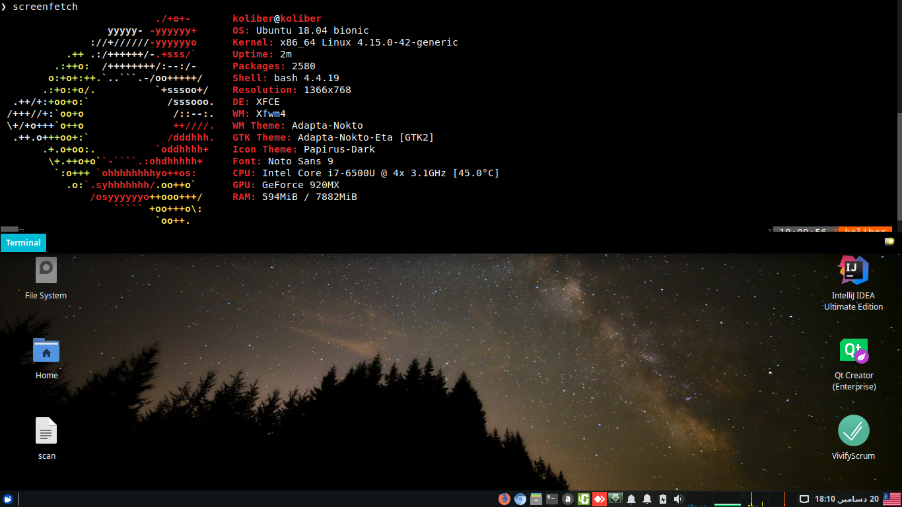
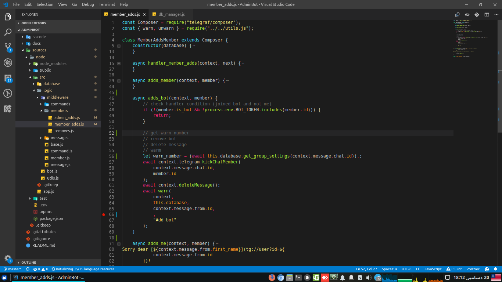
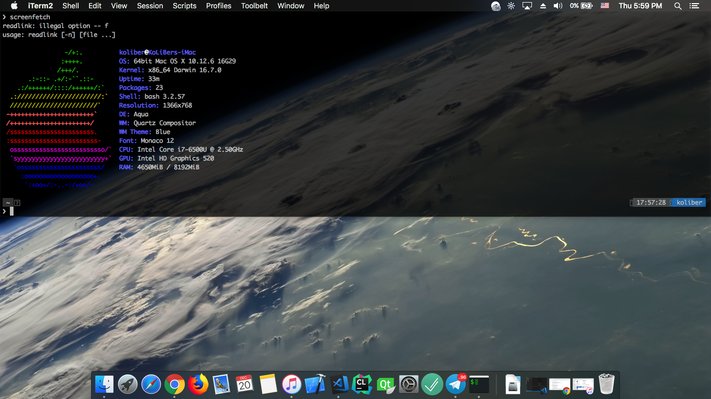
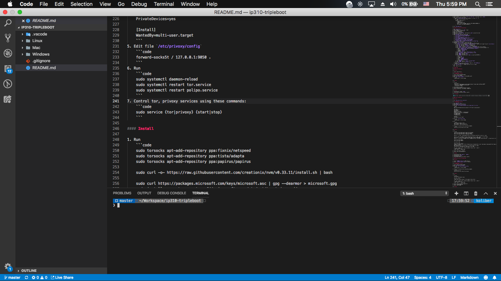

# Triple Boot

> In this quick guide we will discuss how we can `triple boot` our system
>
> **Before you begin, make sure you `backup` all your files !**

## 1. Windows


### Download

Download the windows 10 `.iso` image from [this link](https://soft98.ir/os/windows-10/16142-win-business-1903-a7.html)

---

### Bootable USB

Create a bootable USB from downloaded image using [Rufus](https://rufus.ie/) with these configs:

1. `Partition Schema`: **`GPT`**
2. `Target System`: **`UEFI`**

---

### Installation

Follow these steps:

1. Click `Repair your computer`
2. Open `CMD`
3. Run `diskpart`
4. Convert your partition scheme to `GPT` using commands bellow:

    ```cmd
    list disk
    select disk <hard disk number>
    clean
    convert gpt
    exit
    ```

5. Restart your system
6. Click `Install now`
7. Open installer partitioner
8. Create a partition for your `Windows OS`
9. **Don't install the OS**, restart your system again
10. Click `Repair your computer`
11. Open `CMD`
12. Run `diskpart`
13. Remove the windows recovery partition and add it to your EFI partition using commands bellow:

    ```cmd
    list disk
    select disk <Your HDD>
    sel part 1
    del part OVERRIDE
    sel part 2
    del part OVERRIDE
    create part EFI
    exit
    ```

14. Restart your system
15. Click `Install now`
16. Open installer partitioner
17. Select your partition
18. Install OS

---

### Customization

1. Install drivers using [DriverPack Solution](https://drp.su/en)
2. Install [Chocolatey](https://chocolatey.org/) package manager
3. Install [ProtonVPN](https://protonvpn.com/) or [Tor](https://www.torproject.org/download/) proxy (Hey dude, proxy is one of the most important tools to live in `Islamic Republic Of Iran` :D)
4. Install your favorite apps or just follow these steps to install my favorite apps as your favorites :D

    1. Run commands bellow:

        ```cmd
        choco install winrar vscode uget mpv firefox googlechrome git conemu nvm
        ```

    2. Config **autostart**, **quake style** for `conemu`
    3. Download your `VSCode` settings using `Settings Sync` pluggin (If you have save them before)

---

## 2. GNU/Linux




### Download

Download your favorite GNU/Linux `.iso` from its official link

1. [Xubuntu](https://xubuntu.org/)
2. [Ubuntu](https://ubuntu.com/)
3. [Kubuntu](https://kubuntu.org/)

---

### Bootable USB

Create a bootable USB from downloaded image using [Rufus](https://rufus.ie/) with these configs:

1. `Partition Schema`: **`GPT`**
2. `Target System`: **`UEFI`**

---

### Installation

Follow these steps:

1. Open installer
2. Open installer parititioner
3. Create paritions for your `GNU/Linux` (`swap`, `root`, `boot` and etc)
4. Install OS
5. Add `macOS Clover Bootloader` chainloader item to `GRUB2` using these steps:

    1. Boot your GNU/Linux OS
    2. Edit the file `/etc/grub.d/40_custom` and add these lines at the end of file:

        ```code
        menuentry 'Mac' {
             insmod fat
             insmod part_gpt
             insmod search_fs_uuid
             search --file --no-floppy --set=root /EFI/CLOVER/CLOVERX64.efi
             chainloader /EFI/CLOVER/CLOVERX64.efi
        }
        ```

    3. Run the command `sudo update-grub` to update your grub

---

### Customization

1. Install drivers by command `sudo ubuntu-drivers autoinstall`
2. Run `chmod 0777 /opt` to change permissions of `opt` folder (It will use as a path for installing some applications)
3. Install `Tor` and `Privoxy`:

    1. Run `sudo apt install tor privoxy`
    2. Edit file `/etc/systemd/system/multi-user.target.wants/tor.service`

        ```code
        [Unit]
        Description=Anonymizing overlay network for TCP (multi-instance-master)

        [Service]
        User=debian-tor
        Type=simple
        RemainAfterExit=yes
        ExecStart=/usr/bin/tor -f /etc/tor/torrc
        ExecReload=/usr/bin/kill -HUP $MAINPID
        KillSignal=SIGINT
        LimitNOFILE=8192
        PrivateDevices=yes

        [Install]
        WantedBy=multi-user.target
        ```

    3. Edit file `/etc/privoxy/config`

        ```code
        forward-socks5t / 127.0.0.1:9050 .
        ```

    4. Run

        ```code
        sudo systemctl daemon-reload
        sudo systemctl restart tor.service
        sudo systemctl restart polipo.service
        ```

    5. Control tor, privoxy services using these commands:

        ```code
        sudo service {tor|privoxy} {start|stop}
        ```
    6. Add iptable rules for routing all traffics from `Tor`
        
        ```code
        iptables -t nat -A OUTPUT -m owner --uid-owner $(id -u debian-tor) -j RETURN
        iptables -t nat -A OUTPUT -p udp --dport 53 -j REDIRECT --to-ports 9053
        iptables -t nat -A OUTPUT -p tcp --syn -j REDIRECT --to-ports 9050
        ```
        
    7. Add torrc configs
    
        ```code
        TrackHostExits gitlab.com
        AutomapHostsOnResolve 1
        DNSPort 9053
        TransPort 9052
        ```

4. Install my favorite apps by following these steps:

    1. Run commands bellow:

        ```code
        sudo torsocks apt-add-repository ppa:fixnix/netspeed
        sudo torsocks apt-add-repository ppa:tista/adapta
        sudo torsocks apt-add-repository ppa:papirus/papirus

        sudo curl -o- https://raw.githubusercontent.com/creationix/nvm/v0.33.11/install.sh | bash

        sudo curl https://packages.microsoft.com/keys/microsoft.asc | gpg --dearmor > microsoft.gpg
        sudo install -o root -g root -m 644 microsoft.gpg /etc/apt/trusted.gpg.d/
        sudo sh -c 'echo "deb [arch=amd64] https://packages.microsoft.com/repos/vscode stable main" > /etc/apt/sources.list.d/vscode.list'

        sudo torsocks apt update
        sudo torsocks apt upgrade

        nvm install node

        sudo torsocks apt install \
        steam unrar code uget mpv firefox chromium-browser git guake docker.io gcc clang cmake anydesk erlang openjdk-8-jdk lamp-server^ \
        audacious redshift \
        apt-transport-https ca-certificates curl software-properties-common \
        indicator-multiload adapta-gtk-theme papirus-icon-theme

        git clone --depth=1 https://github.com/Bash-it/bash-it.git ~/.bash_it
        ~/.bash_it/install.sh
        # edit .bashrc => change Theme
        ```

    2. Config **autostart**, **quake style** for `guake`
    3. Download your `VSCode` settings using `Settings Sync` pluggin (If you have save them before)

---

## 3. Mac




### Download

Download the Mac Mojave (`10.14.x`) `.dmg` image from [this link](https://soft98.ir/os/mac-os-x/3411-macos-sierra.html)

---

### Bootable USB

Create a bootable USB from downloaded image using one of these methods:

1. Mac + [Unibeast](https://www.tonymacx86.com/resources/unibeast-9-2-0-mojave.426/)
    1. Use another Mac
    2. Use [Virtualized Mac with vmware](https://techsviewer.com/install-macos-high-sierra-vmware-windows-pc/)
2. Windows + [TransMac](https://www.acutesystems.com/scrtm.htm)
3. Linux + `dmg2img` using commands bellow:

    ```bash
    sudo apt install dmg2img
    sudo dmg2img -v -i /path/to/mac.dmg -o /dev/sdb
    ```

After creating a bootable mac you need to copy the `Clover Bootloader` to your bootable USB `EFI` partition:

1. Mount the `EFI` partition of bootable USB
2. Extract zip file [Clover](https://github.com/koliberr136a1/ip310-tripleboot/blob/master/Mac/clover.zip)
3. Copy extracted files into `/EFI/CLOVER`

> The `clover.zip` file is customized for `Lenovo IP310-15ISK` laptop, and you may have some boot problems with it, please write your cutomized `config.plist` for clover based on your system configurations

Customized `clover.zip` patches:

1. **Battery**:
    1. `DSDT.aml`
    2. `ACPIBatteryManager.kext`
2. **Audio**:
    1. `VoodooHDA.kext`
3. **Keyboard, Trackpad**:
    1. `VoodooPS2Controller.kext`
4. **GPU (Intel HD520)**:
    1. `Framebuffer 9mb (config.plist)` patch
    2. `Lilu.kext`
    3. `WhateveryGreen.kext`
    4. `IntelGraphicsFixup.kext`
5. **Backlight**:
    1. `DSDT-PNLF.aml`
    2. `AppleBacklightFixup.kext`
6. **RAM**:
    1. `Dual channel, One slot (config.plist)` patch
7. **CPU**:
    1. `CPUFriend.kext`
8. **Hibernate**:
    1. `HibernationFixup.kext`

---

### Installation

1. Open installer
2. Open installer parititioner
3. Create paritions for your `Mac` with `APFS` format
4. Install OS
5. Add `macOS Clover Bootloader` to your system `EFI` partition:
    1. Copy the extracted items of `clover.zip` (Clover Bootloader) to `/EFI/CLOVER`

---

### Customization

1. Install [HoRNDIS](https://joshuawise.com/horndis) driver for USB tethering
2. Install [Homebrew](https://brew.sh/) package manager
3. Install `Tor` and `Privoxy`:

    1. Run `brew install tor privoxy`
    2. Edit file `/usr/local/etc/privoxy/config`

        ```code
        forward-socks5t / 127.0.0.1:9050 .
        ```

    3. Control tor, privoxy services using these commands:

        ```code
        brew services list
        brew services {start|stop} {tor|privoxy}
        ```

4. Install my favorite apps by following these steps:

    1. Run commands bellow:

        ```code
        brew install unrar git

        brew cask install visual-studio-code mpv firefox google-chrome iterm2 anydesk

        git clone --depth=1 https://github.com/Bash-it/bash-it.git ~/.bash_it
        ~/.bash_it/install.sh
        # edit .bashrc => change Theme
        ```

    2. Config **autostart**, **quake style** for `ITerm2`
    3. Download your `VSCode` settings using `Settings Sync` pluggin (If you have save them before)

---
